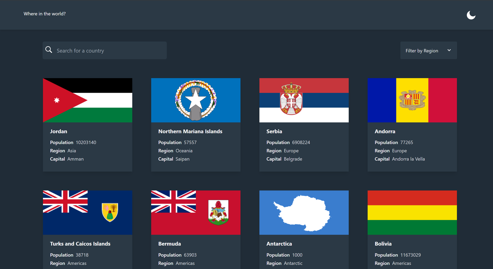

# Frontend Mentor - REST Countries API with color theme switcher solution

This is a solution to the [REST Countries API with color theme switcher challenge on Frontend Mentor](https://www.frontendmentor.io/challenges/rest-countries-api-with-color-theme-switcher-5cacc469fec04111f7b848ca). Frontend Mentor challenges help you improve your coding skills by building realistic projects.

## Table of contents

- [Installing](#installing)
- [Overview](#overview)
  - [The challenge](#the-challenge)
  - [Screenshot](#screenshot)
  - [Links](#links)
- [My process](#my-process)
  - [Built with](#built-with)
  - [Tests](#tests)

## Installing

```bash
# Clone this repository
$ git clone https://github.com/doniyoraloxanov/Entertainment-web-app.git

# Installing all the dependencies
$ npm install

# Run the app
$ npm start
```

## Overview

### The challenge

Users should be able to:

- View the optimal layout for the app depending on their device's screen size
- See hover states for all interactive elements on the page
- Navigate between Home, Movies, TV Series, and Bookmarked Shows pages
- Add/Remove bookmarks from all movies and TV series
- Search for relevant shows on all pages
- **Bonus**: Build this project as a full-stack application
- **Bonus**: If you're building a full-stack app, we provide authentication screen (sign-up/login) designs if you'd like to create an auth flow

### Screenshot



### Links

- Live Site URL: https://entertainment-web-app-kappa.vercel.app/

## My process

### Built with

- React
- Redux toolkit
- React Router v6
- Tailwind CSS

### Useful resources

- [How to create a Dropdown select component in React?](https://medium.com/tinyso/how-to-create-a-dropdown-select-component-in-react-bf85df53e206#id_token=eyJhbGciOiJSUzI1NiIsImtpZCI6Ijg1YmE5MzEzZmQ3YTdkNGFmYTg0ODg0YWJjYzg0MDMwMDQzNjMxODAiLCJ0eXAiOiJKV1QifQ.eyJpc3MiOiJodHRwczovL2FjY291bnRzLmdvb2dsZS5jb20iLCJuYmYiOjE2ODU4NjY0MzIsImF1ZCI6IjIxNjI5NjAzNTgzNC1rMWs2cWUwNjBzMnRwMmEyamFtNGxqZGNtczAwc3R0Zy5hcHBzLmdvb2dsZXVzZXJjb250ZW50LmNvbSIsInN1YiI6IjEwNTA5MTQxOTUyNDQ2NTc2NjA0NiIsImVtYWlsIjoieW91Y3JhY2ttYW5AZ21haWwuY29tIiwiZW1haWxfdmVyaWZpZWQiOnRydWUsImF6cCI6IjIxNjI5NjAzNTgzNC1rMWs2cWUwNjBzMnRwMmEyamFtNGxqZGNtczAwc3R0Zy5hcHBzLmdvb2dsZXVzZXJjb250ZW50LmNvbSIsIm5hbWUiOiJEb25peW9yIEFsb3hhbm92IiwicGljdHVyZSI6Imh0dHBzOi8vbGgzLmdvb2dsZXVzZXJjb250ZW50LmNvbS9hL0FBY0hUdGRTMnNYTWxnNHkxclJ5TWNIU1ZaM0piSW5VZnVKS0VvXzFNR003PXM5Ni1jIiwiZ2l2ZW5fbmFtZSI6IkRvbml5b3IiLCJmYW1pbHlfbmFtZSI6IkFsb3hhbm92IiwiaWF0IjoxNjg1ODY2NzMyLCJleHAiOjE2ODU4NzAzMzIsImp0aSI6ImE1ZWQ4YzBjMzI0NWU1OTE3M2Y3MDBiMWZmZThkYWFmNzM2MzhiNWUifQ.YTQvROysWOKKDBue3BDmJLRVDlcFJd5cvT1yj-YXKGfvNZSlTqR1NPJU3Dgeh-K6jarS-bAfQOp1N0sxBP_UaUfyxJmSxyZf5b5fDZZZ0ydMFU--P5s1JRYEMIbUhhLx8PQhlu-3wC2jUAiq5nG2zijc5RXJ4hGqKfoVFzNKurhP589jBZq4zaxOGlrYWwJMSMQYS7GtSwsfNunr8-0UQn6Ang7WGA4XPyQIF6r8KVxce0RxcEDf_N9_MImGEDyUQMd5M6CFNPiFhHDFfv6vPxyT6puu4V1yVgnSJ_C4gqCoYU5DiX32BGXNBtI0wz1zlCIYTiid3QVjYjbDD4bD8g)

## Author

- Website - [www.idoniyor.com](https://www.idoniyor.com)
- Frontend Mentor - [@aloxanovme](https://www.frontendmentor.io/profile/aloxanovme)
